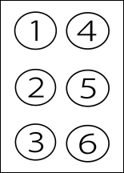

# Quest Tools

## About this Project
Web-application built with the help of python and Flask 
to provide easy access to some useful adjustible tools 
for solving online quests.

  * [Morse code translator](#morse-code-translator)
  * [Braille code translator](#braille-code-translator)
  * [Mendeleev periodic table reference](#mendeleev-periodic-table-reference)
  * [RU/EN alphabet to numbers and reverse](#ru-en-alphabet-to-numbers-and-reverse)
  * [RU anagrams (one- and two-word)](#ru-anagrams--one--and-two-word-)
  * [Olympiika word game helper](#olympiika-word-game-helper)
  * [Caesar code decoder](#caesar-code-decoder)
  * [Flag semaphore decoder](#flag-semaphore-decoder)

## Morse code translator
Dots and dashes to letters and reverse.

**Input:** \
word OR several words OR ...---...

**Examples:** \
'sos' => ... --- ... \
'hello world' => .... . .-.. .-.. --- .-- --- .-. .-.. -..\
'- . ... -' => тест test

## Braille code translator
Braille code uses numerical coding presented in this figure:

**Input:** \
word OR several words OR 13456 15 234 \

**Examples:** \
'hello world' => ⠓⠑⠇⠇⠕ ⠺⠕⠗⠇⠙ \
'13456 15 234' => yes yес

## Mendeleev periodic table reference
Quick reference of chemical elements by number, name, or symbol.

**Input:** \
element number OR several numbers OR element name/names \
separated by whitespace.

**Examples:** \
'12' => '12 Magnesium Магний Mg' \
'8 7 45 69' => 'O N Rh Tm' \
'O N Rh Tm' => '8 7 45 69' \
'тантал' => '73 Tantalum Тантал Ta'

## RU/EN alphabet to numbers and reverse
Simple letters to numbers and reverse conversion.

**Input:** \
latin and cyrillic letters OR numbers.

**Examples:** \
'hello' => '8 5 12 12 15'\
'8 5 12 12 15' => 'ждккн hello'\
'12 1 4 25' => 'кагч lady'

## RU anagrams (one- and two-word)
This app uses hash-table of anagrams created from
big database of russian words.

**Input:** \
one word - you get full anagram and possible 2-word anagrams,\
two and more words - you get full anagram for each word.

**Examples:** \
'проверка' => \
'Букв: 8 \
Полная анаграмма: проварке, проверка\
Варианты из двух слов:\
капер, карпе, крапе, крепа, парке, перка, репка + вор, вро, ров\
правке + ор, ро\
провар, прорва + ЕК, ке\
...' 

'слово море вода' => \
'слово (5): волос, ослов, слово\
море (4): ером, море, омер, орем, роем, роме\
вода (4): адов, вода'

## Olympiika word game helper
This app uses data from sociation.org and
other sources to provide options of connected words.

**Input:** \
One word - list of assosiated words.\
Two words - list of common assosiations for these words.

**Examples:** \
'крона' => 'крона = древо, корона, деньги, макушка, 
ветки, голова, монета, деревья, темя, гребень, чехия, 
батарейка ...'

'море пляж' => 'акула, ракушки, вода, закат ...'

## Caesar code decoder
Caesar Code Decoder provides one clear option 
using corresponding russian or english dictionary.\
Indicates shift of the alphabet in the output.

**Input:** \
Coded word or phrase.

**Examples:** \
'Ёв, н аъйжв ювжущ сяэы!' => '18: Чу, я слышу пушек гром!'\
'Iwxh xh hdbt higxcv! Vgtpi!' => '11: This is some string! Great!'

## Flag semaphore decoder
Translates into letters letter-coded positions 
of flags written according to the figure: 

**Input:**\
Letter-coded positions of right and left hand. Whitespace separates letters.

**Exmaples:**\
'нл-нп л-нл лн-в л-в л-н нл-нп лв-пн н-п' => 'абырвалг'

